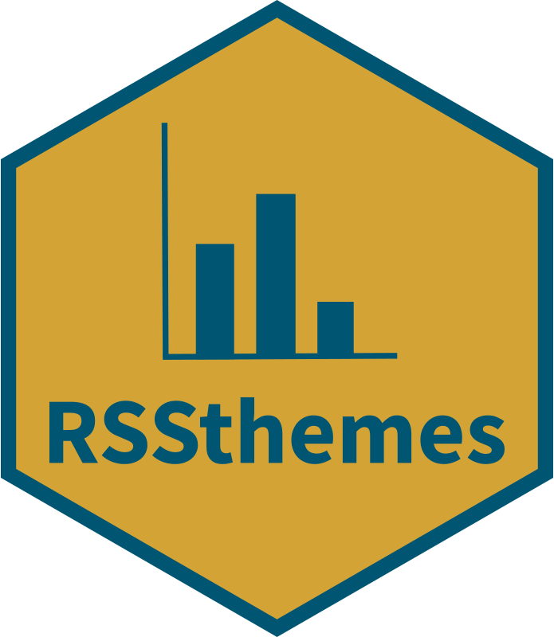

<!-- badges: start -->
  [](https://github.com/nrennie/RSSthemes/actions/workflows/R-CMD-check.yaml)
  [](https://cran.r-project.org/package=RSSthemes)
<!-- badges: end -->

# {RSSthemes} 

{RSSthemes} is an R package for styling graphics for RSS publications. This package accompanies the *Best Practices for Data Visualisation* guidance, published by the Royal Statistical Society, which can be found at [royal-statistical-society.github.io/datavisguide](https://royal-statistical-society.github.io/datavisguide/). 

This package, the data visualisation guidance site and its content are under development, and the authors welcome feedback and contributions.

## Using the {RSSthemes} package

A brief overview of the package is given below. For a more in-depth discussion of this R package please see [royal-statistical-society.github.io/datavisguide/docs/tools.html](https://royal-statistical-society.github.io/datavisguide/docs/tools.html) for the most up-to-date information.

You can install the package from CRAN using:

```r
install.packages("RSSthemes")
```

You can install the development version from [GitHub](https://github.com/nrennie/RSSthemes) with:

```r
remotes::install_github("nrennie/RSSthemes")
```

You can then load the package using:

```r
library(RSSthemes)
```

### Colour palettes

There are currently three palettes available in {RSSthemes}, although we hope to add more in the future. 

#### Using palettes with {ggplot2}

Let’s set up a basic data set.

```r
library(ggplot2)
plot_df <- data.frame(x = LETTERS[1:4],
                      y = 1:4)
```

**Single colour charts**

If all of the bars, lines, points, etc. should have the same colour, you can set either the `fill` or `colour` arguments to have one of the RSS colours. The options are: `signif_red`, `signif_blue`, `signif_green`, `signif_orange`, or `signif_yellow`.

```r
ggplot(data = plot_df,
       mapping = aes(x = x, y = y)) +
  geom_col(fill = signif_yellow)
```


**Qualitative palettes**

For working with qualitative (discrete) data, the best palette to use is `"signif_qual"`. This palette currently only contains four colours.

Discrete (fill) scale: `scale_fill_rss_d()`

```r
ggplot(data = plot_df,
       mapping = aes(x = x, y = y, fill = x)) +
  geom_col() +
  scale_fill_rss_d(palette = "signif_qual")
```


Discrete (colour) scale: `scale_colour_rss_d()`

```r
ggplot(data = plot_df,
       mapping = aes(x = x, y = y, colour = x)) +
  geom_point(size = 4) +
  scale_colour_rss_d(palette = "signif_qual")
```


**Sequential palettes**

For working with sequential (continuous) data, the best palette to use is `"signif_seq"`.

Continuous (fill) scale: `scale_fill_rss_c()`

```r
ggplot(data = plot_df,
       mapping = aes(x = x, y = y, fill = y)) +
  geom_col() +
  scale_fill_rss_c(palette = "signif_seq")
```


Continuous (colour) scale: `scale_colour_rss_c()`

```r
ggplot(data = plot_df,
       mapping = aes(x = x, y = y, colour = y)) +
  geom_point(size = 4) +
  scale_colour_rss_c(palette = "signif_seq")
```


**Diverging palettes**

For working with diverging (continuous) data, the best palette to use is `"signif_div"`.

Continuous (fill) scale: `scale_fill_rss_c()`

```r
ggplot(data = plot_df,
       mapping = aes(x = x, y = y, fill = y)) +
  geom_col() +
  scale_fill_rss_c(palette = "signif_div")
```


If you want to centre the diverging scale around a different value, you can alternatively pass the pre-defined colours into `scale_fill_gradient2()` from {ggplot2}:

```r
ggplot(data = plot_df,
       mapping = aes(x = x, y = y, fill = y)) +
  geom_col() +
  scale_fill_gradient2(low = signif_red, high = signif_blue, midpoint = 2)
```


#### Using palettes with base R

If all of the bars, lines, points, etc. should have the same colour, you can set `col` arguments to have one of the RSS colours. The options are: `signif_red`, `signif_blue`, `signif_green`, `signif_orange`, or `signif_yellow`.

```r
barplot(table(mtcars$gear), col = signif_blue)
```


You can use the `set_rss_palette()` function to change the default colours used in base R plotting:

```r
set_rss_palette("signif_qual")
plot(1:4, 1:4, col=1:4, pch=19, cex=3, xlab="", ylab="")
```


Run `palette("default")` to reset to original base R colours.

### Theme functions

Theme functions style the non-data elements of plots, e.g. fonts, text colour, or background colour.

#### Using themes with {ggplot2}

Apply styling to plots made with {ggplot2} using the `theme_significance()`
function:

```r
ggplot(data = plot_df,
       mapping = aes(x = x, y = y, fill = x)) +
  geom_col() +
  labs(title = "My Significance Plot",
       subtitle = "Some longer sentence explaining what is happening in the chart.",
       caption = "Source: name of data source") +
  scale_fill_rss_d(palette = "signif_qual") +
  theme_significance()
```


#### Using themes with base R

Apply styling to plots made with base R using the `set_signif_par()`
function. We also recommend adding reference lines using the `abline()` function:

```r
set_signif_par()
plot(1:4, 1:4, col=1:4, pch=19, cex=3, xlab="", ylab="",
     main = "My Significance Plot",
     sub = "Source: data source")
abline(h=1:4, v=1:4, col = "lightgrey")
```


## Contributor guidelines

### To make a suggestion or ask a question

Please open up a discussion in the repository's [Discussions](https://github.com/royal-statistical-society/datavisguide/discussions) section.

### If you spot a bug or an error

Please either:

1.  Raise an issue in the repository's [Issues](https://github.com/nrennie/RSSthemes/issues) section, or
2.  Fork this repository, edit the relevant file(s), and make a pull request against the `main` branch of this repository.

### If you want to add a new feature or section to the R package:

1.  Raise an issue in the repository's [Issues](https://github.com/nrennie/RSSthemes/issues) section, tag it as an 'enhancement' and describe your proposed contribution.
2.  Fork this repository and create a new branch named, e.g., `my-new-feature-or-section`.
3.  Add content, code and files to your branch.
4.  Make a pull request against the `main` branch of this repository.

Proposals for new features will be reviewed by the lead author team ("lead authors"):

-   Andreas Krause

-   Nicola Rennie

-   Brian Tarran

Lead authors may offer feedback or suggestions to contributors before agreeing to merge pull requests. Lead authors reserve the right to refuse to merge pull requests, and the decision of the lead authors is final.

Use of, and all contributions to, our website and repository are governed by our [Code of Conduct](https://github.com/nrennie/RSSthemes/blob/main/CODE_OF_CONDUCT.md).

This package is licensed under a [Creative Commons Attribution 4.0 (CC BY 4.0) International licence](https://creativecommons.org/licenses/by/4.0/?ref=chooser-v1), meaning it can be used and adapted for any purpose, provided attribution is given to the original authors. By contributing to this guide, contributors agree to licence their work under the same terms.

This package stores and loads *Source Sans Pro* fonts for use in the theme functions. Source Sans Pro font was developed by Paul D. Hunt, and more information can be found at [fonts.adobe.com/fonts/source-sans](https://fonts.adobe.com/fonts/source-sans). These fonts have the following copyright: Copyright 2010, 2012, 2014 Adobe Systems Incorporated [https://www.adobe.com/](https://www.adobe.com/), with Reserved Font Name ‘Source’. The fonts are licensed under the SIL Open Font License, Version 1.1. See: [http://scripts.sil.org/OFL](http://scripts.sil.org/OFL).
