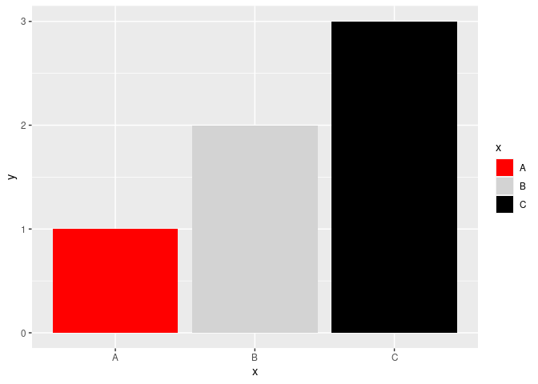
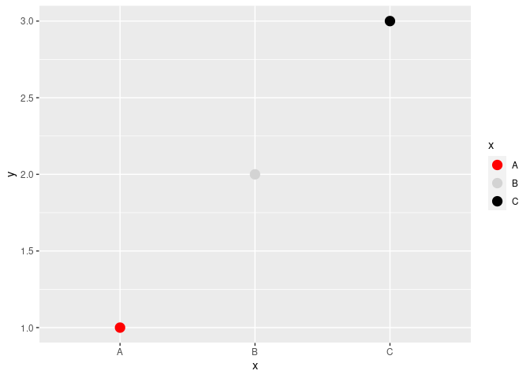
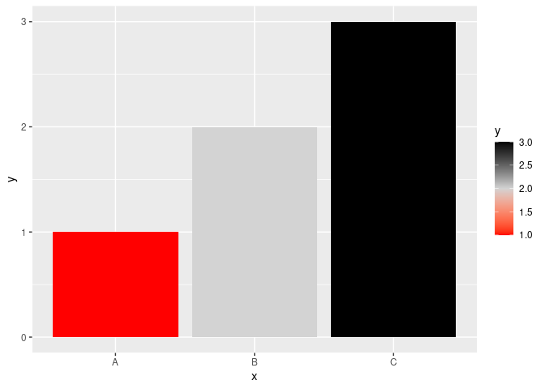
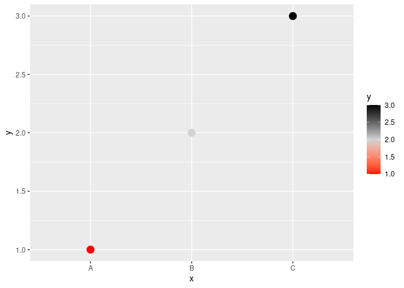
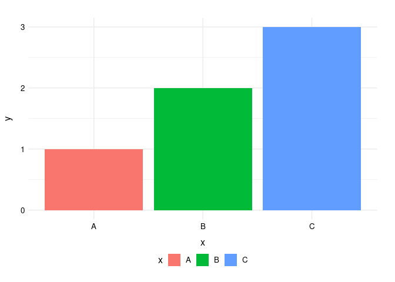

# DO NOT EDIT README.md by hand - only edit README.Rmd.

R package to implement scale and theme functions for styling {ggplot2}
graphics for RSS publications.

    library(RSSthemes)

# Colour palettes

## Using palettes with base R graphics

## Using palettes with {ggplot2}

Let’s set up a basic data set.

    library(ggplot2)
    plot_df <- data.frame(x = LETTERS[1:3],
                          y = 1:3) 

### Colouring geoms

### Discrete (fill) scale: `scale_fill_rss_d()`

    ggplot(data = plot_df,
           mapping = aes(x = x, y = y, fill = x)) +
      geom_col() +
      scale_fill_rss_d(palette = "Significance")

### Discrete (colour) scale: `scale_colour_rss_d()`

    ggplot(data = plot_df,
           mapping = aes(x = x, y = y, colour = x)) +
      geom_point(size = 4) +
      scale_colour_rss_d(palette = "Significance")

### Continuous (fill) scale: `scale_fill_rss_c()`

    ggplot(data = plot_df,
           mapping = aes(x = x, y = y, fill = y)) +
      geom_col() +
      scale_fill_rss_c(palette = "Significance")

### Continuous (colour) scale: `scale_colour_rss_c()`

    ggplot(data = plot_df,
           mapping = aes(x = x, y = y, colour = y)) +
      geom_point(size = 4) +
      scale_colour_rss_c(palette = "Significance")

# Theme functions

## Using themes with {ggplot2}

Apply styling to non-data elements using the `theme_significance()`
function:

    ggplot(data = plot_df,
           mapping = aes(x = x, y = y, fill = x)) +
      geom_col() +
      theme_significance()

